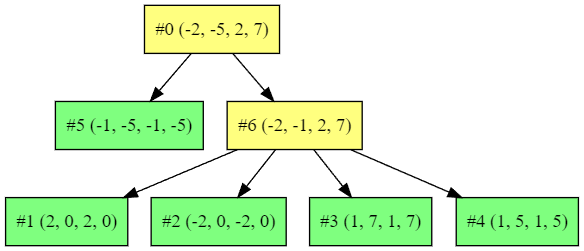

# rustree

An RTree implementation in Rust



https://github.com/msakuta/rustree/assets/2798715/abb0217d-1435-4fd9-b27e-2618bb84b3c9


## What is this?

RTree is a common data structure to quickly find an object from large amount of candidates scatterd in space.

There are handful of crates already for Rust, but this crate is unique in that it uses linear memory (Vec) to store the objects.

```rust
pub struct RTree<T> {
    nodes: Vec<RTreeEntry<T>>,
}
```

Usually RTree uses tree data structure, as the name implies. However, Rust is known to be extremely difficult to work with graph data structure, such as linked lists and trees.
What you tend to end up with is the excessive use of `Rc<RefCell<T>>` and `Weak<RefCell<T>>`, which is not ergonomic nor performant.
I use a method inspired by Entity Component System found in games to flatten the tree to a linear vector to remove the need of `Rc`s and `RefCell`s.

Note that `HashMap` can do a very similar thing. After all, `HashMap` is just a method to flatten random objects in a graph to a linear memory.

Also note that I don't read the original paper. I just wanted to implement from my imagination without referring to the paper and see how far it goes.


## How to run GUI demo

GUI demo:

```
cargo r -p rustree-gui
```

The main library crate is isolated from GUI (egui/eframe) dependencies, so you need to specify the subcrate by `-p` to run the demo.


## How to run console demo

[Console demo](examples/points.rs):

```
cargo r --example points
```


# References

* The original paper http://www-db.deis.unibo.it/courses/SI-LS/papers/Gut84.pdf
